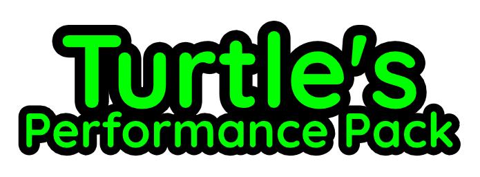

   
   
  

    Simple and fast open-source OptiFine alternative for modern loaders
     
    <a href="https://github.com/intergrav/Additive/wiki">Explore the wiki</a>
    ·
    <a href="https://github.com/intergrav/Additive/issues">Report Bugs</a>
    ·
    <a href="https://github.com/intergrav/Additive/issues">Request Features</a>
  

  
  

TPP is a modpack designed as an **alternative to OptiFine**. It includes the majority of OptiFine's features, such as built-in shader support, a vast improvement in rendering and logic performance, extra features for resource packs to utilize, a zoom feature, OptiFine and custom capes support, and [much more](https://github.com/intergrav/Additive/wiki/Give-up-OptiFine). It also includes a small amount of [extra features](https://github.com/intergrav/Additive/wiki/Extra-features), such as input fixes for MacOS and Linux along with a free and easy-to-use world hosting feature. This modpack is built and kept in sync with my other project, [Adrenaline](https://modrinth.com/modpack/adrenaline), a lighter alternative without the quality-of-life mods. Want your own mods that aren't included in TPP? Don't worry! You can easily add your favorite mods after installation.

# 🎯 Goals

### 🔥 Performance
This modpack is based on [Additive](https://modrinth.com/modpack/additive), which is a very light weight OptiFine alternative.

### 🔍 OptiFine features

TPP utilizes various mods that offers the same features that OptiFine did while also being modular so that you can remove features you don't want or features that are incompatible with other mods. This includes, but is not limited to:

- Major performance boost from [Adrenaline](https://modrinth.com/modpack/adrenaline)
- OptiFine resource pack features
- Built-in shaders support
- Dynamic lighting from held objects
- Better grass and snow
- OptiFine donator capes
- OptiFine zoom feature

### 💡 Other features
TPP contains a very small amount of non-OptiFine features - mainly being small fixes, such as [EmuNO](https://modrinth.com/mod/emuno) and [Fix Keyboard on Linux](https://modrinth.com/mod/fix-keyboard-on-linux). There's also [World Host](https://modrinth.com/mod/world-host), which lets you host your world to the public by simply clicking "Open Externally" in the pause menu. [Borderless Mining](https://modrinth.com/mod/borderless-mining) is tucked away for convenience, disabled by default, but you can enable it in the mod menu.

### ⚙️ Source-available

All mods in TPP are either open-source or source-available, which means you can view the code of mods and see exactly what they are doing. TPP is also available as [packwiz projects on GitHub](https://github.com/amturtle/tpp) so that you can easily view what's being changed, contribute if you would like to, or fork the modpack to create your own project. If you would like to view the mods shipped with TPP, simply look at the dependencies in the Modrinth page or look in the Git repository.

# ❓ Why Over OptiFine?

OptiFine used to be the go-to solution for enhancing performance in Minecraft and offered many additional features that users loved. However, recent developments have changed the situation. OptiFine functions as a type of "all-in-one" mod, making it impossible to disable certain features that are incompatible with other mods. Additionally, its closed-source nature presents a challenge for modders who are unable to fix compatibility issues. OptiFine is not natively compatible with Fabric or Quilt and requires a separate mod, OptiFabric, which is difficult to keep up to date. This has led to the creation of alternative mods that work just as well, if not better, and are easier to update. TPP usually updates much quicker than OptiFine does. While the transition may take some time to get used to, the overall experience is much improved compared to OptiFine.

For a full list of currently supported features, see this [wiki page](https://github.com/intergrav/Additive/wiki/Give-up-OptiFine).

# ✅ Hardware Compatibility

TPP supports the use of graphics cards with drivers that are compatible with OpenGL 4.6. Most graphics cards released in 2010 or later are compatible. This includes the following hardware:

- Intel HD Graphics 500 Series (Skylake) or newer
- Nvidia GeForce 400 Series (Fermi) or newer
- AMD Radeon HD 7000 Series (GCN 1) or newer

In some cases, older graphics cards may also work (as long as they have drivers which support OpenGL 3.3) but they are not officially supported and may not be compatible in the future.

Android devices that use OpenGL translation layers (such as GL4ES, ANGLE, etc) are not supported and will likely not work with TPP's set of mods. These translation layers do not implement required functionality and suffer from underlying driver bugs which cannot be worked around.

If you are running into problems, you should make sure that your graphics drivers are up-to-date. I also recommend taking a look at [this page](https://github.com/CaffeineMC/sodium-fabric/wiki/Driver-Compatibility) on the Sodium wiki.

*The majority of this was taken from Sodium's hardware compatibility section. I'll update this accordingly if anything is changed.*

<!--
packwiz mr/cf add <mod-name>
packwiz mr/cf remove <mod-name>
packwiz mr/cf update <mod-name>

just export fabric
-->